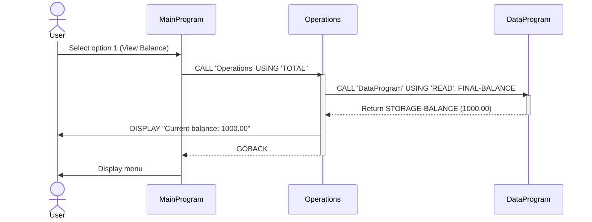
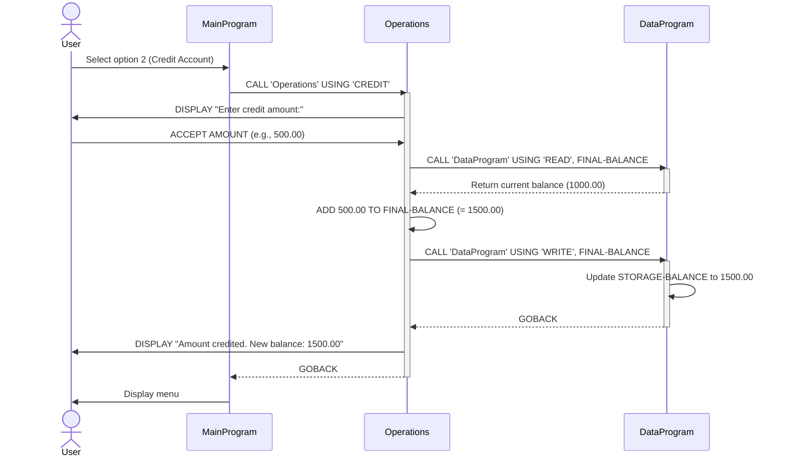
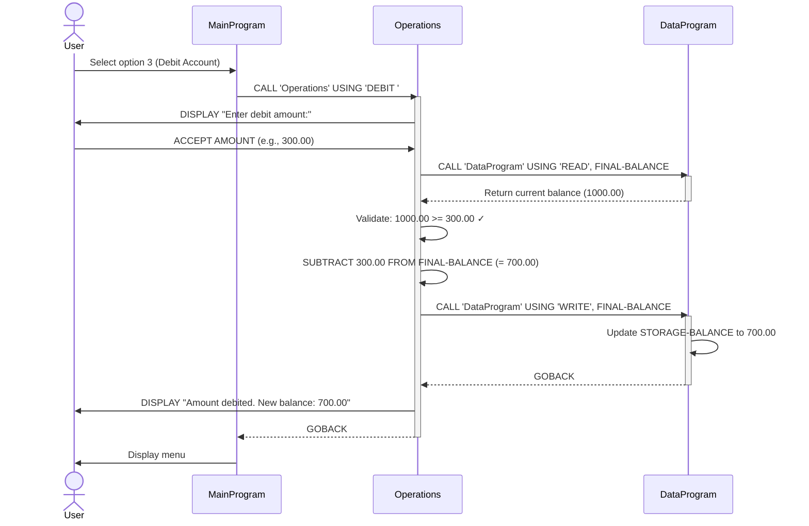
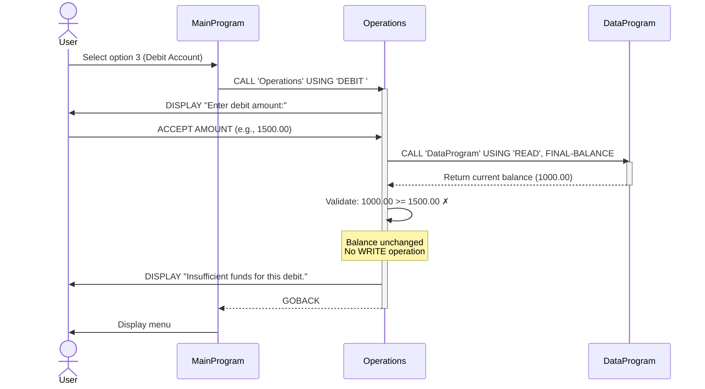
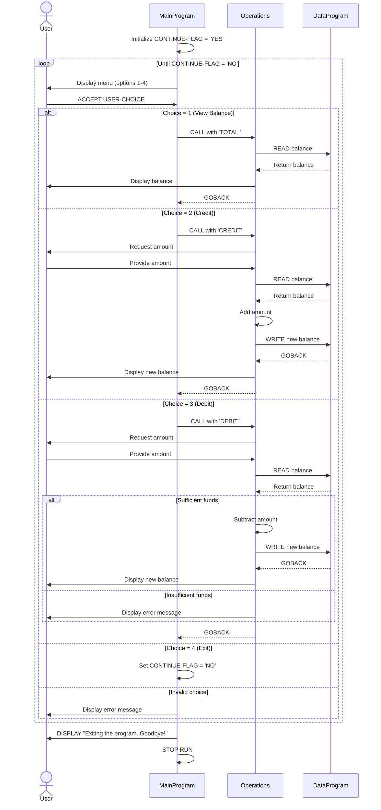

# COBOL Account Management System Documentation

## Overview

This system is a legacy COBOL-based account management application designed to handle student account operations. The system provides basic banking functionality including balance inquiries, credits, and debits through a menu-driven interface.

## System Architecture

The application follows a modular design with three distinct COBOL programs that work together:

1. **MainProgram** - User interface and menu system
2. **Operations** - Business logic and transaction processing
3. **DataProgram** - Data access layer

---

## File Descriptions

### main.cob (MainProgram)

**Purpose:** Entry point and user interface controller for the account management system.

**Key Functions:**
- Displays the main menu with available operations
- Accepts user input for menu selection
- Routes user choices to appropriate operation handlers
- Manages the application lifecycle (startup and shutdown)

**Menu Options:**
1. View Balance - Display current account balance
2. Credit Account - Add funds to the account
3. Debit Account - Withdraw funds from the account
4. Exit - Terminate the program

**Data Structures:**
- `USER-CHOICE` (PIC 9): Stores the user's menu selection (1-4)
- `CONTINUE-FLAG` (PIC X(3)): Controls the main program loop ('YES' or 'NO')

**Program Flow:**
- Runs in a continuous loop until user selects option 4 (Exit)
- Calls the `Operations` program with appropriate operation codes
- Validates menu selection and displays error message for invalid choices

---

### operations.cob (Operations)

**Purpose:** Business logic layer that processes account transactions and enforces business rules.

**Key Functions:**

#### 1. TOTAL (View Balance)
- Retrieves current balance from data layer
- Displays balance to user
- Read-only operation

#### 2. CREDIT (Add Funds)
- Prompts user for credit amount
- Retrieves current balance
- Adds credit amount to balance
- Updates balance in data layer
- Displays new balance

#### 3. DEBIT (Withdraw Funds)
- Prompts user for debit amount
- Retrieves current balance
- Validates sufficient funds are available
- Subtracts debit amount from balance (if sufficient funds)
- Updates balance in data layer
- Displays new balance or error message

**Data Structures:**
- `OPERATION-TYPE` (PIC X(6)): Operation to perform ('TOTAL ', 'CREDIT', 'DEBIT ')
- `AMOUNT` (PIC 9(6)V99): Transaction amount (up to 999,999.99)
- `FINAL-BALANCE` (PIC 9(6)V99): Working balance variable

**Integration:**
- Called by MainProgram with operation type
- Calls DataProgram for all data access operations
- Returns control to MainProgram after completing operation

---

### data.cob (DataProgram)

**Purpose:** Data persistence layer that manages account balance storage and retrieval.

**Key Functions:**

#### 1. READ Operation
- Returns current stored balance
- Copies `STORAGE-BALANCE` to caller's balance variable

#### 2. WRITE Operation
- Updates stored balance
- Copies caller's balance value to `STORAGE-BALANCE`

**Data Structures:**
- `STORAGE-BALANCE` (PIC 9(6)V99): Persistent balance storage (initialized to 1000.00)
- `OPERATION-TYPE` (PIC X(6)): Operation requested ('READ' or 'WRITE')
- `PASSED-OPERATION` (PIC X(6)): Linkage parameter for operation type
- `BALANCE` (PIC 9(6)V99): Linkage parameter for balance value

**Implementation Notes:**
- Uses LINKAGE SECTION for parameter passing
- Maintains balance in working storage (simulates persistence)
- Returns control via GOBACK after operation completion

---

## Business Rules

### Student Account Rules

1. **Initial Balance**
   - All accounts start with a default balance of $1,000.00
   - Configured in DataProgram's `STORAGE-BALANCE` initialization

2. **Maximum Balance**
   - Maximum balance: $999,999.99
   - Enforced by PIC 9(6)V99 data type (6 digits + 2 decimals)

3. **Transaction Amounts**
   - Maximum transaction: $999,999.99
   - Minimum transaction: $0.00
   - Enforced by PIC 9(6)V99 data type

4. **Overdraft Protection**
   - **Critical Business Rule:** Debit transactions are rejected if they would result in a negative balance
   - System displays "Insufficient funds for this debit" message when debit amount exceeds available balance
   - Balance remains unchanged when debit is rejected

5. **Credit Operations**
   - No maximum limit validation on credits (beyond data type constraint)
   - Credits are always processed if amount is valid numeric input

6. **Balance Precision**
   - All monetary values use 2 decimal places
   - Supports cents/fractional currency units

---

## Data Flow

```
User Input → MainProgram → Operations → DataProgram
                ↓              ↓            ↓
            Menu Loop    Business Logic  Data Storage
                ↓              ↓            ↓
            Display ← Results ← Balance ← Storage
```

### Typical Transaction Flow:

1. **View Balance:**
   - MainProgram calls Operations with 'TOTAL '
   - Operations calls DataProgram with 'READ'
   - DataProgram returns balance
   - Operations displays balance to user

2. **Credit Account:**
   - MainProgram calls Operations with 'CREDIT'
   - Operations prompts for amount
   - Operations calls DataProgram with 'READ' to get current balance
   - Operations adds credit amount
   - Operations calls DataProgram with 'WRITE' to save new balance
   - Operations displays new balance

3. **Debit Account:**
   - MainProgram calls Operations with 'DEBIT '
   - Operations prompts for amount
   - Operations calls DataProgram with 'READ' to get current balance
   - Operations validates sufficient funds
   - If valid: Operations subtracts amount, calls DataProgram with 'WRITE'
   - If invalid: Operations displays error, balance unchanged
   - Operations displays result

---

## Technical Specifications

### Program Calls
- Uses COBOL `CALL` statement with `USING` clause for inter-program communication
- Parameters passed by reference
- Operations and DataProgram use `GOBACK` to return control

### Data Types
- **PIC 9(6)V99**: Numeric with 6 integer digits and 2 decimal places
- **PIC X(n)**: Alphanumeric text fields
- **PIC 9**: Single digit numeric

### Constants
- Initial balance: 1000.00
- Operation codes: 'TOTAL ', 'CREDIT', 'DEBIT ', 'READ', 'WRITE'

---

## Limitations and Considerations

1. **Data Persistence:** Balance is stored in working storage, not a database or file. Balance resets to $1,000.00 each time the program starts.

2. **Single Account:** System manages only one account at a time. No student ID or account identification.

3. **No Audit Trail:** Transactions are not logged or recorded for historical reference.

4. **Input Validation:** Limited validation on amount inputs. Non-numeric inputs may cause runtime errors.

5. **Concurrency:** Not designed for multi-user access or concurrent transactions.

6. **Currency:** No currency type specification. Assumes single currency system.

---

## Future Enhancement Opportunities

- Implement file I/O for persistent balance storage
- Add student account identification and multi-account support
- Implement transaction history and audit logging
- Add transaction date/time stamps
- Enhance input validation and error handling
- Add transaction limits and daily withdrawal caps
- Implement account types (checking, savings, etc.)
- Add interest calculation functionality
- Create reporting capabilities

---

## Maintenance Notes

When modifying this system, ensure:
- Operation codes remain exactly 6 characters (padded with spaces)
- Balance calculations maintain 2 decimal precision
- Overdraft protection logic is preserved
- Menu numbering stays synchronized between display and evaluation logic

---

## Sequence Diagrams

### View Balance Operation



### Credit Account Operation



### Debit Account Operation (Sufficient Funds)



### Debit Account Operation (Insufficient Funds)



### Complete Program Flow


